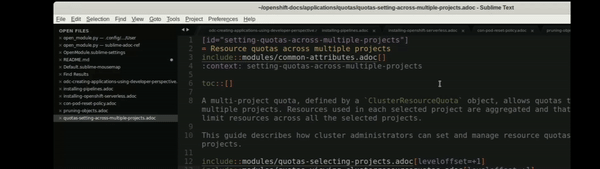

# sublime-adoc-ref



Sublime plugin that allows you to navigate to `include::` and `xref::` *.adoc references in asciidoc files.

* Download the repo files and unzip. 
* Copy all files to `~/.config/sublime-text-3/Packages/User/`
* Add a key mapping to `~/.config/sublime-text-3/Packages/User/Default (Linux).sublime-keymap`, for example:
```
[
    { "keys": ["ctrl+alt+m"], "command": "open_module" }
]
```

* Also, optionally, configure a [ctrl + mouse click] shortcut in `Default.sublime-mousemap`, for example: 
```
[
    {
        "button": "button1", 
        "count": 1, 
        "modifiers": ["ctrl"],
        "press_command": "drag_select",
        "command": "open_module"
    }
]
```
