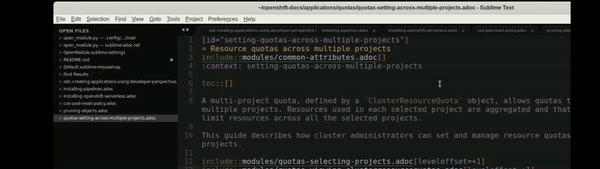

# Follow AsciiDoc references



Sublime Text plugin that allows you to navigate to `include::` and `xref:` references in AsciiDoc files. Supports both plain AsciiDoctor xrefs and Antora-style cross-references.

## Features

- **Ctrl+Click** navigation to `include::` and `xref:` targets
- Supports `include::` directives for `.adoc`, `.yaml`, `.yml`, `.txt`, and `.json` files
- Supports plain Asciidoctor xrefs: `xref:path/to/file.adoc#anchor[label]`
- Supports Antora-style xrefs: `xref:version@component:module:page.adoc#anchor[label]`
- Automatic underlining of clickable references
- Resolves relative paths, Antora module paths, and project-root paths

## Installation

1. Add the `sublime-adoc-ref` repository to Sublime Text via **Package Control: Add Repository**: `https://github.com/aireilly/sublime-adoc-ref`
2. Open **Package Control: Install Package**, search for `sublime-adoc-ref`, and install it.

## Configuration

### Project file

Configure a `.sublime-project` file for your AsciiDoc project. Ensure that the `path` variable is set:

```json
{
    "folders": [
        {
            "path": ".",
            "follow_symlinks": false
        }
    ]
}
```

A global `OpenModule.sublime-settings` file can also be used, but project-level settings take precedence.

### Key binding (optional)

Add a key mapping to `~/.config/sublime-text/Packages/User/Default (Linux).sublime-keymap`:

```json
[
    { "keys": ["ctrl+alt+m"], "command": "open_module" }
]
```

### Mouse binding (optional)

The plugin ships with a default Ctrl+Click binding for AsciiDoc files. To customize it, add the following to `~/.config/sublime-text/Packages/User/Default.sublime-mousemap`:

```json
[
    {
        "button": "button1",
        "count": 1,
        "modifiers": ["ctrl"],
        "press_command": "drag_select",
        "command": "open_module",
        "context": [
            {"key": "selector", "operand": "text.asciidoc"}
        ]
    }
]
```

> **Note:** You can check the active scope in Sublime Text with **Tools > Developer > Show Scope Name** (Ctrl+Alt+Shift+P).
