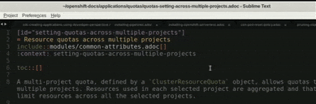

# Follow AsciiDoc references



Sublime plugin that allows you to navigate to `include::` and `xref::` asciidoc references in asciidoc files.


1. Add the `sublime-adoc-ref` project repo to Sublime Text > *Package control*: Add repository: https://github.com/aireilly/sublime-adoc-ref.
2. Open Sublime Text > *Package control*, search for `sublime-adoc-ref` and install the package. and the newly added package.
3. Configure a `.sublime-project` file for your AsciiDoc project. Ensure that the path variable is set. For example:

```
{
    "folders": [
        {
            "path": ".",
            "follow_symlinks": false
        }
    ]
}
```

4. You can also add a global `sublime-settings` file, but this will be overridden by a local `.sublime-project`.  
5. Add a key mapping to `~/.config/sublime-text/Packages/User/Default (Linux).sublime-keymap`, for example:
```
[
    { "keys": ["ctrl+alt+m"], "command": "open_module" }
]
```

* Also, optionally, configure a [ctrl + mouse click] shortcut in `~/.config/sublime-text/Packages/User/Default.sublime-mousemap`, for example: 
```
[
    {
        "button": "button1", 
        "count": 1, 
        "modifiers": ["ctrl"],
        "press_command": "drag_select",
        "command": "open_module"
    }
]
```
